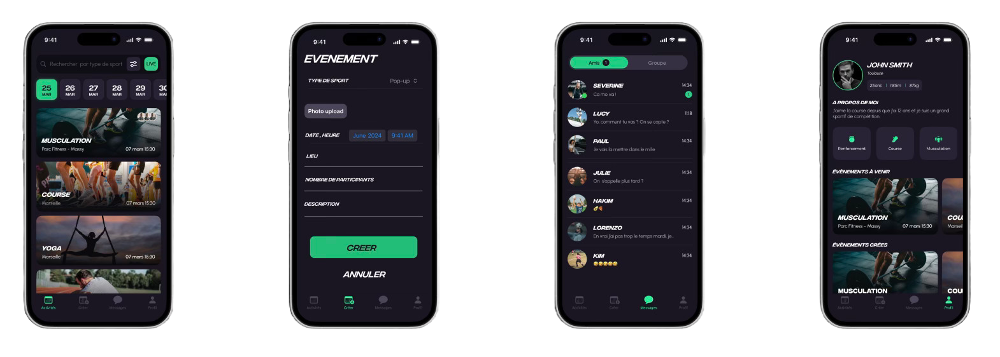

🔹 État actuel du développement :

- ✅ Interface utilisateur finalisée avec SwiftUI, début d'implémentation Swift Data

🔹 Fonctionnalités :

- Consultation  et création d'activités sportives
- Participation à un évènement
- Recherche de partenaires
- Suivi de performances
- Messagerie & ajout d'amis
  
Petit aperçu en image :

  

